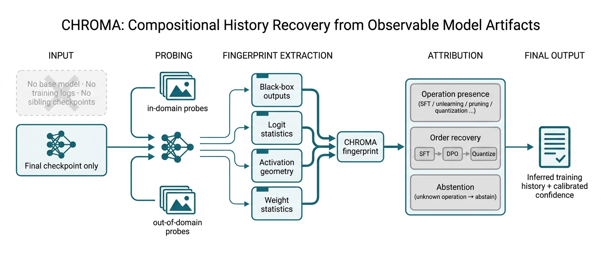

# CHROMA

**C**ompositional **H**istory **R**ecovery from **O**bservable **M**odel **A**rtifacts

Base-free forensic attribution of post-training histories: given only a final
model checkpoint and a fixed public probe set — no base model, no training
logs, no sibling checkpoints — infer *which* post-training operations were
applied and *in which order*, know when to abstain, and map which histories
are observationally indistinguishable.

Like chromatography, CHROMA separates a mixture into its components and their
order of application.



## Key results (leave-root-out throughout; 40–400 scratch-trained roots)

| Question | Answer |
|---|---|
| Single-op attribution, behavior-matched (6-class, chance .167) | **0.87** base-free vs 0.37 confound-only (reference-aware upper bound 1.00) |
| Order recovery (sft↔unlearn / prune / quant reversed pairs) | **0.94 / 1.00 / 1.00** — reference-aware delta features are order-blind on sft↔quant (0.50) |
| Root vs op-seed variance in fingerprints | **87–100% root** — grouped (leave-root-out) splits are mandatory; random splits are invalid in this problem |
| Cross-family transfer (5 CNN families) | 0.28 raw → **0.44** with transductive per-population normalization |
| Cross-dataset transfer (CIFAR-10 ↔ SVHN) | chance — a genuine identifiability limit |
| Open-set (unknown ops distill/merge) | base-free AUROC 0.70 vs reference-aware 0.997 — reference access is decisive here |
| Laundering (2-epoch benign fine-tune, zero utility cost) | best surviving method: CHROMA composite 0.43; functional fingerprints and raw-weight PCA collapse to ≤0.25 |
| Identifiability map (14 histories × 91 pairs) | 85 distinguishable / 6 uncertain — every uncertain pair follows the **recency rule**: the last operation dominates the fingerprint |
| TDA (persistence homology descriptors) | redundant under all five pre-registered criteria in this regime |

Reproduced prior-method variants under the same protocol (REEF-style relational
CKA, weight-space PCA, functional probe profiles, Delta-Activations-style
reference features) are all dominated by the CHROMA composite on the matched
attribution task and under laundering; see `runs/baselines/`.

## Layout

```
autopsy/                 pipeline (zoo, fingerprints, evaluations)
run_pilot.py             driver: --stage zoo|fingerprint|eval|pairs|openset|launder|grid|identify|baselines
Representation_Forensics_Research_Plan.md   full research plan (Korean)
runs/*/manifest.jsonl    model manifests (root group, history, intensity, hashes)
runs/*/fingerprints.npz  extracted descriptors (models regenerable via manifests)
runs/*/results*.json     all evaluation results
runs/identifiability/    pairwise distinguishability heatmaps
```

## Environment

Python 3.12, PyTorch cu130, torchvision, scikit-learn, ripser/persim.
Datasets load offline from a local torchvision root at `data/` (junction/symlink
to your dataset directory). Single consumer GPU is enough: the full 2,800-model
generalization grid builds in ~70 minutes on an RTX 5090.

## Status

Research code for a paper in preparation. Checkpoints are not committed;
every model is regenerable from `manifest.jsonl` (deterministic seeds) via
`run_pilot.py`.
